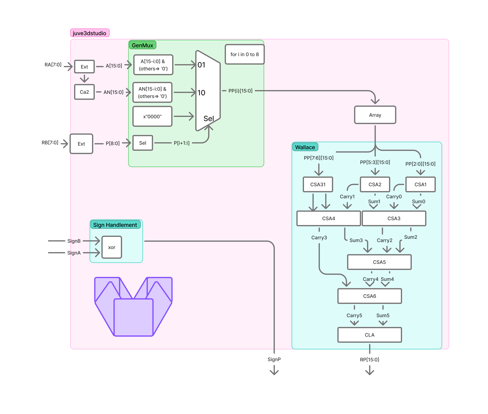

# Examen2Booth - Documentacion de src


## Descripcion general

Este proyecto implementa un multiplicador de 8x8 bits con manejo de signo separado:

- `RA[7:0]` y `RB[7:0]`: magnitudes de entrada.
- `SignA` y `SignB`: signo de cada operando.
- `P_out[15:0]`: magnitud del resultado.
- `SignP`: signo del resultado (equivalencia de signos de entrada).

La arquitectura combina:

- Generacion de productos parciales tipo Booth (ventanas de 2 bits).
- Red de reduccion tipo Wallace con sumadores carry-save.
- Suma final con un adder de 16 bits (`CLA_16Bits`).

## Estructura de carpetas

```text
src/
	code/
		0T_Booth.vhd      # Top-level: entidad Multiplier
		Carrysave.vhd     # Sumador carry-save 3:2 de 16 bits
		Adder16bits.vhd   # Sumador final de 16 bits (CLA_16Bits)
		Comp2.vhd         # Complemento a 2 de 16 bits
		tb.vhd            # Testbench principal
		wave.vcd          # Dump de simulacion (generado)
		work-obj93.cf     # Libreria de trabajo de GHDL (generado)

	GowinProject/
		P7.gprj           # Proyecto Gowin
		src/              # Copia de fuentes para sintesis
		impl/             # Resultados de sintesis y place&route
```

## Modulos RTL


### 1) `Multiplier` (`0T_Booth.vhd`)

Top-level del diseño.

Funciones principales:

- Extiende `RA` a 16 bits (`A <= x"00" & RA`).
- Calcula `AN` (complemento a 2 de `A`) mediante `Comp2`.
- Construye `P <= '0' & RB` para evaluar pares superpuestos de bits.
- Genera 9 productos parciales (`PP(0)` a `PP(8)`) con seleccion:
	- `01` -> `+A` desplazado.
	- `10` -> `-A` desplazado (`AN`).
	- otro caso -> `0`.
- Reduce productos parciales con 7 etapas carry-save (`CSA1..CSA6` y `CSA31`).
- Realiza suma final con `CLA_16Bits`.
- Calcula signo de salida: `SignP <= not(SignA xor SignB)`.

### 2) `CarrySave` (`Carrysave.vhd`)

Sumador 3:2 combinacional de 16 bits:

- `S = IN1 xor IN2 xor IN3`
- `sCarry = carry << 1`

Se usa en la red Wallace para reducir tres operandos en dos por etapa.

### 3) `CLA_16Bits` (`Adder16bits.vhd`)

Sumador de 16 bits con propagacion de carry combinacional:

- Entradas: `C_A`, `C_B`, `C_cin`.
- Salida: `C_S`.

Es la etapa final para convertir los dos vectores de la red carry-save en el resultado `P_out`.

### 4) `Comp2` (`Comp2.vhd`)

Calcula complemento a 2 de 16 bits (`NOT(MC) + 1`).

Se utiliza para generar los productos parciales negativos del algoritmo Booth.

### 5) `tb_Multiplier` (`tb.vhd`)

Banco de pruebas con casos de:

- signo positivo/negativo,
- multiplicacion por cero,
- valores limite representativos (`0x7F`, `0x80`).

## Flujo rapido de simulacion (GHDL)

Desde `src/code/`:

```bash
ghdl -a Comp2.vhd Carrysave.vhd Adder16bits.vhd 0T_Booth.vhd tb.vhd
ghdl -e tb_Multiplier
ghdl -r tb_Multiplier --vcd=wave.vcd
```

Para visualizar formas de onda:

```bash
gtkwave wave.vcd
```

## Notas

- El diseno maneja magnitud y signo por separado; `P_out` representa magnitud y `SignP` el signo de salida.
- `src/GowinProject/src/` contiene una copia de los RTL para sintesis en Gowin.
